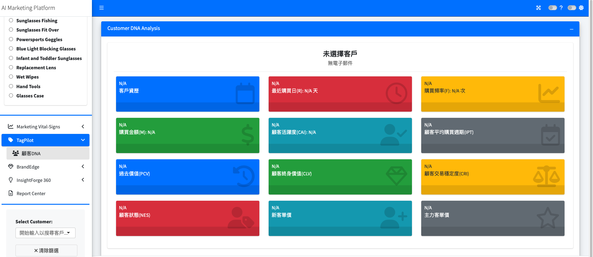

# Issue #147: QEF Dashboard - Multiple UI/Data Issues

**Status**: open
**Date**: 2026-02-10
**Source**: 向創儀表板建議_20260209.docx
**Discovered in**: QEF_DESIGN (l4_enterprise)
**Tags**: `QEF_DESIGN`, `UI`, `data`, `customer-feedback`

---

## Summary

向創（QEF）客戶反饋儀表板存在 3 個問題，來自 2026-02-09 的建議文件。

---

## Issue 1: 多個品項宏觀指標監控數據為 0

**嚴重程度**: High

以下 7 個品項的宏觀指標監控（Macro Vital-Signs）數據顯示為 0：

- Safety Glasses Fit Over
- Powersports Goggles
- Blue Light Blocking Glasses
- Replacement Lens
- Wet Wipes
- Hand Tools
- Glasses Case

**可能原因**:
- 這些品項的 ETL 數據未正確匯入或未處理
- DRV 階段未為這些品項生成衍生指標
- 數據源（rawdata）中可能缺少這些品項的銷售/評論資料

**影響範圍**: Marketing Vital-Signs 模組

---

## Issue 2: Product Line 品項名稱需改為中文描述

**嚴重程度**: Medium

目前 Product Line 側邊欄的所有品項名稱都是英文（如 "Sunglasses Fishing"、"Powersports Goggles"），客戶希望全部改為中文描述。

**相關**: 與 Issue #146 (Product Line Tab Alignment) 有關 — coding sheet 中的 tab 名稱使用中英混合格式（如 `太陽眼鏡＿Cycling adult`），需統一處理。

**影響範圍**: 側邊欄 Product Line 選單、所有顯示品項名稱的 UI 元件

---

## Issue 3: TagPilot 沒有數據

**嚴重程度**: High

TagPilot 模組完全沒有數據顯示。從截圖可見，Customer DNA Analysis 頁面所有指標卡片（客戶資歷、最近購買日、購買頻率、購買金額、顧客活躍度、顧客平均購買週期、過去價值、顧客終身價值、顧客交易穩定度、顧客狀態、新客單價、主力客單價）全部顯示 N/A。

**可能原因**:
- D01 DNA Analysis 的 DRV pipeline 尚未針對 QEF 執行
- 客戶識別（2TS）步驟未完成，導致無法建立客戶層級分析
- app_data.duckdb 中缺少必要的衍生表格

**影響範圍**: TagPilot > 顧客DNA 模組

---

## Screenshot

---

## Action Items

- [ ] 調查 7 個品項的數據缺失原因（檢查 rawdata 和 ETL pipeline）
- [ ] 確認 Product Line 中英文對照表，實作中文化
- [ ] 執行 QEF 的 D01 DNA Analysis pipeline，填充 TagPilot 數據
- [ ] 驗證修正後所有品項的宏觀指標正常顯示
