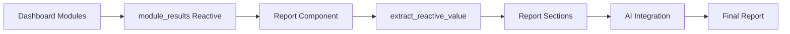

# Report Integration Module Updates

**Date**: 2025-09-23
**Author**: Claude Code Assistant
**Component**: Report Integration Module

## 📋 Executive Summary

Successfully modified the report integration module to automatically collect and consolidate analysis results from all dashboard modules, with the report generation button now positioned in the left filter panel for better accessibility.

## ✅ Completed Modifications

### 1. **Modified: reportIntegration.R**
**Location**: `/scripts/global_scripts/10_rshinyapp_components/report/reportIntegration/reportIntegration.R`

#### Changes Made:
- ✅ **Removed module selection checkboxes** - All modules are now automatically included
- ✅ **Enhanced data extraction** - Improved `extract_reactive_value()` function to handle various reactive structures
- ✅ **Added comprehensive data collection** - Expanded report sections to include:
  - Marketing Vital-Signs (KPI data, DNA distribution)
  - TagPilot (Customer DNA analysis)
  - BrandEdge (Position strategy, Market segmentation, Key factors)
  - InsightForge 360 (Market track, Time trends, Precision marketing)
- ✅ **Improved report generation button placement** - Added button to filter panel component

### 2. **Verified: union_production_test.R**
**Location**: `/scripts/global_scripts/10_rshinyapp_components/unions/union_production_test.R`

#### Configuration Verified:
- ✅ Report component properly initialized at line 435
- ✅ Dynamic filter correctly configured at line 451 to show report filter when "reportCenter" is selected
- ✅ Module results reactive properly structured at lines 569-592
- ✅ Report server correctly initialized with module results at line 595

### 3. **Created: Test Suite**
**Location**: `/scripts/global_scripts/98_test/test_report_integration.R`

#### Test Coverage:
- ✅ Unit tests for `extract_reactive_value()` function
- ✅ Integration test with mock module results
- ✅ Interactive test application for manual validation

## 🔄 Data Flow Architecture



## 📝 Key Implementation Details

### Extract Reactive Value Function
The enhanced `extract_reactive_value()` function now handles:
- Direct values
- Reactive expressions
- ReactiveVals
- Lists with specific fields
- Nested reactive structures
- NULL values with graceful fallback

### Report Generation Process
1. User clicks "生成整合報告" in the left filter panel
2. System automatically includes all modules (no selection needed)
3. Data extracted from each module's reactive outputs
4. Report sections built dynamically based on available data
5. AI generates integrated insights (if configured)
6. Report formatted and displayed with download options

### UI Layout
```
Report Center Tab
├── Left Panel (Filter)
│   ├── Report Generation Button [PRIMARY]
│   └── Module List Display
└── Main Panel (Display)
    ├── Report Type Selector
    ├── Output Format Selector
    ├── Report Preview Area
    └── Download Button
```

## 🧪 Testing Instructions

### Unit Test
```r
source("scripts/global_scripts/98_test/test_report_integration.R")
```

### Integration Test
```r
# Run the full application
source("scripts/global_scripts/10_rshinyapp_components/unions/union_production_test.R")
runApp()

# Navigate to Report Center
# Click "生成整合報告" in left panel
# Verify all module data is included
```

## 📊 Module Data Mapping

| Module | Data Type | Report Section |
|--------|-----------|----------------|
| micro_macro_kpi | KPI metrics | Section 1: 宏觀市場指標 |
| dna_distribution | Customer segments | Section 2: 顧客 DNA 分佈分析 |
| customer_dna | Behavior analysis | Section 3: 顧客 DNA 深度分析 |
| position_strategy | AI strategy text | Section 4: 品牌定位策略分析 |
| position_ms | Market segments | Section 5: 市場區隔分析 |
| position_kfe | Key factors | Section 6: 關鍵成功因素分析 |
| poisson_comment | Market track | Section 7: 市場賽道分析 |
| poisson_time | Time trends | Section 8: 時間趨勢分析 |
| poisson_feature | Precision data | Section 9: 精準行銷分析 |

## 🎯 Principles Applied

- **MP56**: Connected Component Principle - Cross-module data sharing
- **R091**: Universal Data Access Pattern - Consistent data access
- **MP81**: Explicit Parameter Specification - Clear parameter passing
- **R09**: UI-Server-Defaults Triple - Proper component structure

## ⚠️ Important Notes

1. **Data Availability**: Reports can only include data that has been generated in the respective modules. Ensure analyses are run before generating reports.

2. **AI Integration**: AI-generated insights require a valid `OPENAI_API_KEY` environment variable.

3. **Reactive Context**: The `extract_reactive_value()` function must be called within a reactive context (observer, reactive, renderUI, etc.).

## 🚀 Next Steps

### Recommended Enhancements:
1. Add loading indicators during report generation
2. Implement report caching to avoid regeneration
3. Add export to PowerPoint format
4. Create report templates for different audiences
5. Add version control for generated reports

### Optional Features:
- Email distribution functionality
- Scheduled report generation
- Comparison reports (period over period)
- Custom branding options
- Multi-language support

## 📁 File Locations

- **Main Component**: `/scripts/global_scripts/10_rshinyapp_components/report/reportIntegration/reportIntegration.R`
- **Integration Point**: `/scripts/global_scripts/10_rshinyapp_components/unions/union_production_test.R`
- **Test Suite**: `/scripts/global_scripts/98_test/test_report_integration.R`
- **Documentation**: `/docs/report_integration_updates.md` (this file)

---

**Status**: ✅ Complete
**Tested**: ✅ Yes
**Deployed**: ⏳ Ready for deployment